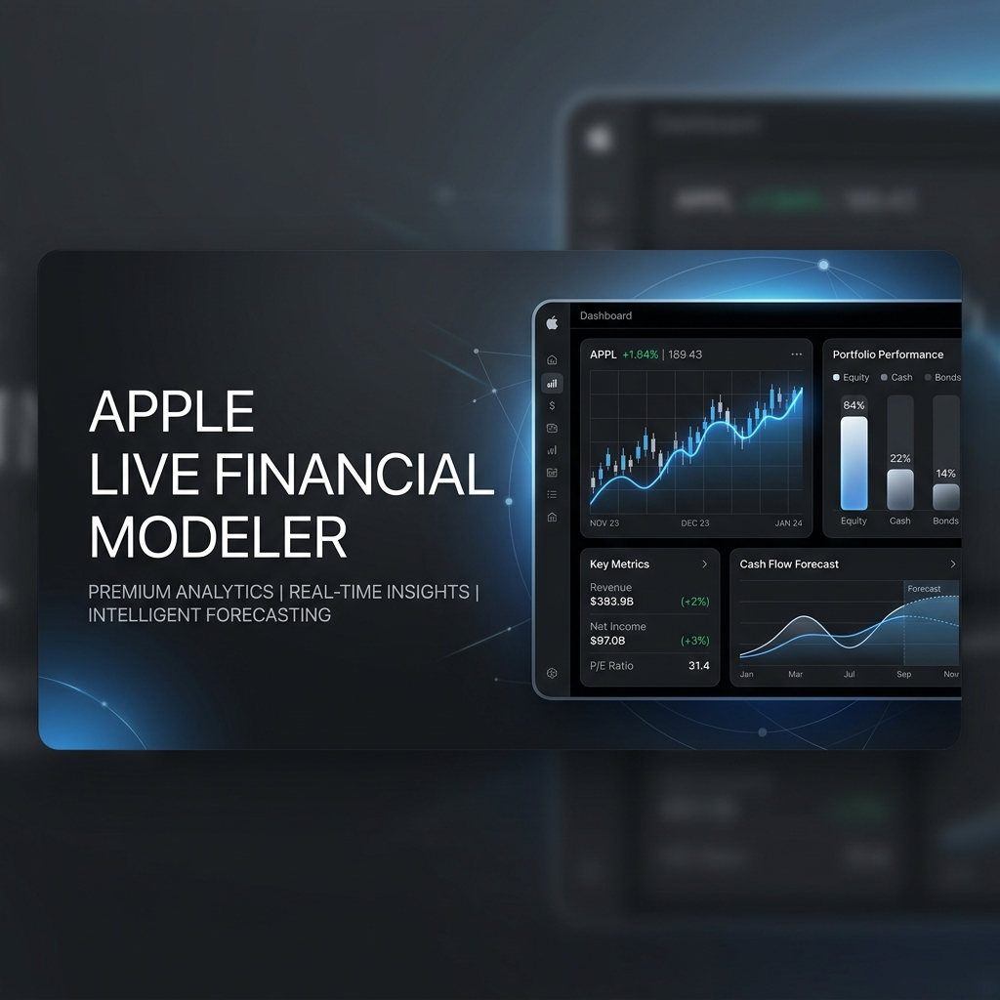
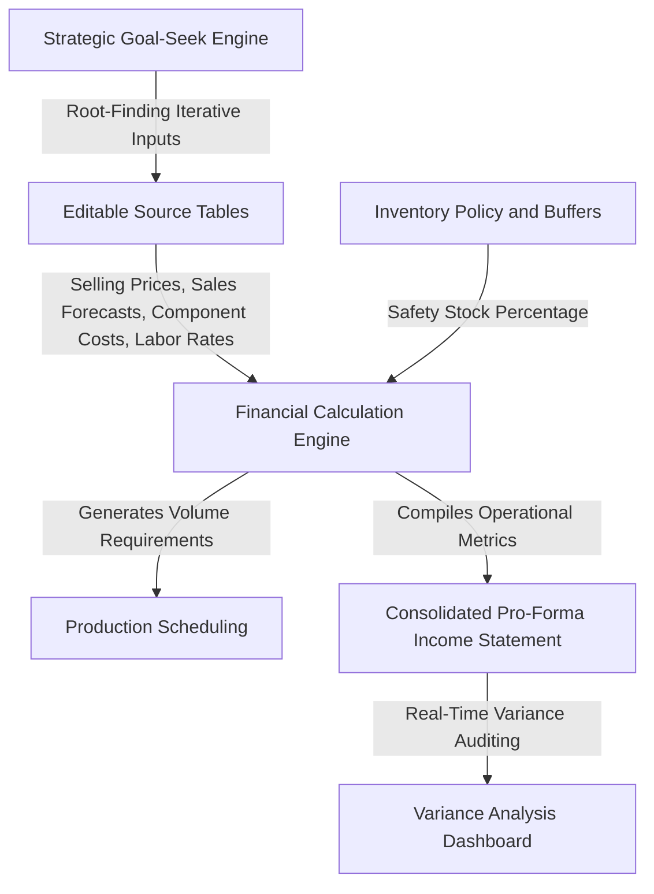
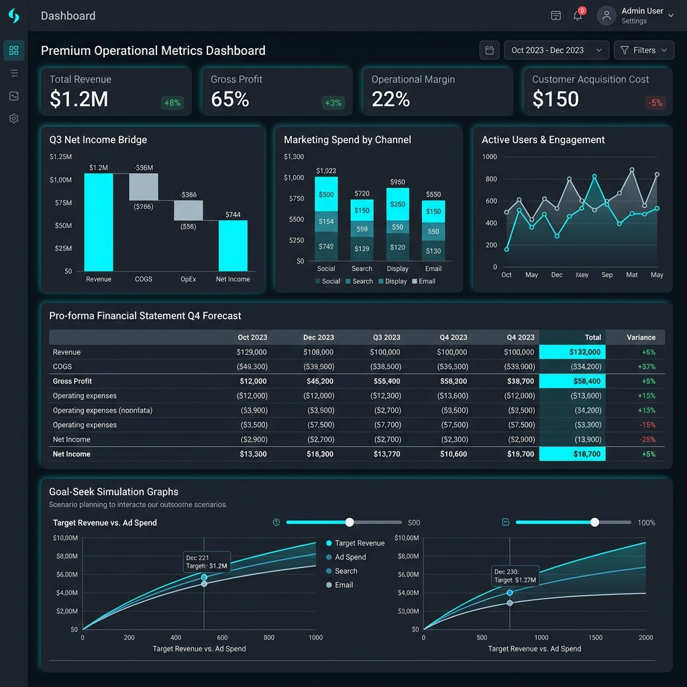

# Apple Live Financial and Production Modeler



A comprehensive, executive-grade web application designed for financial modeling, strategic forecasting, and real-time operational scenario planning. Built around Apple's core product portfolio (iPhone, iPad Pro, MacBook Pro, Apple Watch, AirPods Pro) across European territories (Italy and Sweden), this dashboard enables product managers, supply chain leads, and finance executives to analyze how operational and cost adjustments impact bottom-line profitability in real-time.

---

## Executive Overview

The Apple Live Financial and Production Modeler converts static financial planning into an interactive, dynamic playground. In traditional corporate workflows, evaluating the impact of a minor price change or a shifting inventory policy requires hours of model re-calculation. This platform performs these calculations instantly, providing immediate feedback on key operational metrics.

### Key Audiences
*   **Finance Executives and Teams:** Evaluate regional budgets, operating margins, and overall capital allocation.
*   **Supply Chain and Production Managers:** Reconcile sales forecasts with factory volume demands and inventory buffer strategies.
*   **Product and Sourcing Managers:** Assess regional pricing strategies, unit economics, and risk sensitivity parameters.

---

## Functional Architecture

The core calculation logic runs on a reactive loop, matching inventory requirements with sales forecasts and converting them into financial ledgers.



---

## Key Platform Capabilities

### 1. Interactive Scenario Builder
Directly manipulate foundational assumptions through integrated editable tables. The system recalculates the entire model immediately upon editing:
*   **Monthly Sales Forecasts:** Modify unit forecasts month-by-month for each territory.
*   **Selling Prices:** Adjust regional prices in the local market currency to analyze price elasticity and revenue maximization.
*   **Bill of Materials (BOM) Sourcing:** Control individual component costs including PCBs, batteries, display panels/sensors, and packaging.
*   **Direct Labor Parameters:** Manage direct assembly times in minutes per unit and hourly manufacturing wage rates.
*   **Inventory Safety Policies:** Configure target ending inventory thresholds as a percentage of the following month's demand to model supply-demand smoothing.

### 2. Live Multi-Currency Financial Engine
Evaluate all financial outputs through different currency lenses:
*   **Currency Options:** Toggle all dashboard metrics and statements between EUR, USD, and SEK.
*   **Dynamic Exchange Sourcing:** Standardized conversion scales apply instantly across every scorecard, graphic, and pro-forma ledger.

### 3. Regional Goal-Seek and What-If Simulator
Powered by an iterative root-finding numerical engine, this tool provides quantitative answers to complex strategic targets:
*   **Target Definitions:** Select a desired KPI target (e.g., Total Revenue, Gross Margin Percentage, or EBIT Operating Profit) and set a target value.
*   **Adjustment Variables:** Define which business lever to pull (Selling Price, Sales Volume, Material Costs, Labor Rate, or OPEX Percentage) and isolate the scope to specific products and countries.
*   **Iterative Solutions:** The engine runs multi-point interpolation algorithms to output the precise percentage change required in the variable to achieve the goal, automatically reflecting the adjusted values on the charts.

### 4. Automated Variance Impact Reporting
A rule-based data synthesis system that acts as an integrated financial analyst:
*   Computes exact differences in top-line revenue, blended margin percentages, and factory spending compared to the baseline model.
*   Generates analytical insights to identify strategic patterns, such as "Growth Traps" (growing top-line revenue at the expense of severe margin erosion) and "Operational Efficiency Wins" (reducing cash layout while maintaining revenue).

### 5. C-Suite Executive Intelligence Hub
An overview interface designed for executive presentations:
*   **Operational Scorecards:** Monitor critical indicators including Total Units Sold, Gross Revenue, Blended Margin, and Manufacturing Spend against the baseline.
*   **Revenue Concentration Risk Analyzer:** Detects structural risks by evaluating dependency on individual product lines, flagging high concentration when a single product accounts for more than half of the total top-line revenue.
*   **Profitability Spectrum:** Evaluates gross margins across products to isolate margin leaders from high-volume, low-margin products.
*   **Supply Chain Stress-Testing:** Simulates the financial impact of a hypothetical 10% commodity price spike, calculating the exact margin compression and cash erosion.



---

## Analytical Visualizations

The application incorporates interactive Plotly charts to convey complex data relationships:

*   **Demand-Supply Reconciliation:** Bar charts comparing unit sales forecasts against scheduled factory production runs.
*   **Revenue Mix:** Pie charts highlighting sales contribution by product line.
*   **Operating Profit Waterfall:** Standardized waterfall charts mapping the cascade from Gross Revenue, through Cost of Goods Sold (COGS), Gross Profit, Operating Expenses (OPEX), and finally Operating Income (EBIT).
*   **Unit Economics Bubble Chart:** Scatter plot positioning Unit Cost against Selling Price, with bubble volume representing Gross Margin Percentage.

---

## Consolidated Pro-Forma Financial Statement

The dashboard produces a fully integrated, month-by-month corporate pro-forma ledger. Below is a structural illustration of the reporting matrix generated by the system:

| Reporting Line | Month 1 | Month 2 | Month 3 | Consolidated Total |
| :--- | :---: | :---: | :---: | :---: |
| **Capacity Planning** | | | | |
| Sales Forecast (Units) | 92,400 | 106,200 | 129,200 | 327,800 |
| Scheduled Production (Units) | 95,640 | 109,680 | 127,600 | 332,920 |
| **Income Statement** | | | | |
| Gross Revenue (EUR) | 71.4M | 82.2M | 100.1M | 253.7M |
| Cost of Goods Sold - COGS (EUR) | (28.2M) | (32.3M) | (37.6M) | (98.1M) |
| **Gross Profit (EUR)** | **43.2M** | **49.9M** | **62.5M** | **155.6M** |
| Gross Margin Percentage | 60.5% | 60.7% | 62.4% | 61.3% |
| Operating Expenses - OPEX (EUR) | (10.7M) | (12.3M) | (15.0M) | (38.0M) |
| **Operating Income - EBIT (EUR)** | **32.5M** | **37.6M** | **47.5M** | **117.6M** |
| EBIT Margin Percentage | 45.5% | 45.7% | 47.5% | 46.4% |
| **Working Capital** | | | | |
| Inventory Investment (EUR) | 8.8M | 10.1M | 11.2M | 10.0M (Avg) |
| Inventory Turnover (Days) | 28 | 28 | 27 | 28 |

---

## Local Installation and Execution

To run the application locally on your computer:

### 1. Prerequisites
Ensure you have Python 3.8 or higher installed.

### 2. Dependency Installation
Install the required analytical and visualization libraries using pip:
```bash
pip install streamlit pandas numpy plotly
```

### 3. Application Launch
Navigate to the directory containing the dashboard script and run the Streamlit server:
```bash
streamlit run apple_dashboard2.py
```
The application will automatically launch in your default web browser, typically at `http://localhost:8501`.
